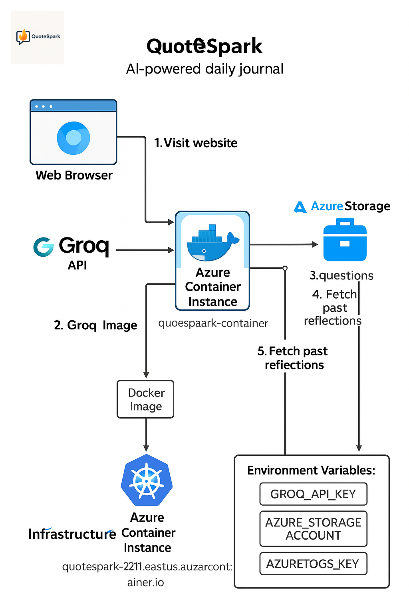

# QuoteSpark - AI-Powered Daily Reflection Journal

## 📖 Project Overview

**QuoteSpark** is a modern web application that helps people reflect, grow, and connect with others—one question at a time. Every day, QuoteSpark uses advanced AI to generate a unique, thought-provoking question. Users can read the question, write their own reflection, and submit it. Each submitted reflection is:

- **Securely stored in Azure Blob Storage** for the user’s own record
- **Posted anonymously to a public feed** so anyone visiting the website can see how others are feeling and reflecting

### **What Problem Does QuoteSpark Solve?**

In a world where people often feel isolated or overwhelmed, QuoteSpark:

- **Promotes daily self-reflection** with meaningful prompts
- **Makes journaling easy and accessible** from any device
- **Builds a sense of community** by letting users see anonymous reflections from others, helping everyone realize they’re not alone in their thoughts and feelings
- **Encourages empathy and connection** by sharing real, anonymous reflections

### **Who Is It For?**

- **Anyone** seeking self-improvement, mindfulness, or a sense of connection
- **Students, professionals, and the general public** interested in journaling or understanding how others are feeling

### **How Does It Work?**

1. **AI-Generated Questions:** Each day, the site fetches a new question from a powerful language model (Groq API).
2. **User Reflection:** Users read the question and submit their own reflection.
3. **Public Feed:** The submitted reflection is posted anonymously to a public feed visible to all visitors.
4. **Secure Storage:** Reflections and questions are stored in Azure Blob Storage.
5. **Review & Growth:** Users and visitors can read the public feed to see how others are reflecting and feeling.

### **Technology Behind the Solution**

- **Frontend:** Modern HTML5/CSS3 with a beautiful, responsive design
- **Backend:** Go (Golang) web server running in an Azure Container Instance
- **AI Integration:** Groq API for generating daily questions
- **Cloud Storage:** Azure Blob Storage for secure, persistent data
- **Containerization:** Docker for consistent, portable deployments
- **Infrastructure as Code:** Terraform for automated, reproducible Azure setup

**QuoteSpark** empowers users to reflect, connect, and grow—while building a supportive, anonymous community.

### 🏗️ Architecture Overview



## 🛠️ Technology Stack

### Backend

- **Language**: Go 1.23.2
- **Framework**: Standard Go HTTP server
- **Containerization**: Docker with multi-stage builds
- **AI Integration**: Groq API for question generation

### Infrastructure

- **Infrastructure as Code**: Terraform
- **Cloud Platform**: Microsoft Azure
- **Compute**: Azure Container Instances (ACI)
- **Storage**: Azure Blob Storage
- **Container Registry**: Azure Container Registry (ACR)

### Frontend

- **HTML5/CSS3**: Modern, responsive design with glassmorphism effects
- **JavaScript**: Interactive animations and user experience enhancements
- **Templates**: Go HTML templates for server-side rendering

## 📁 Project Structure

```tree
quotespark/
├── app/                          # Go application source code
│   ├── main.go                   # Main application entry point
│   ├── blob.go                   # Azure Blob Storage operations
│   ├── gpt_groq.go              # Groq API integration
│   ├── generate_question.go      # Question generation logic
│   ├── seed_refelctions.go       # Sample data generation
│   ├── generate_reflections.go   # Reflection generation utilities
│   ├── templates/
│   │   └── index.html           # Main web interface
│   ├── Dockerfile               # Multi-stage Docker build
│   ├── go.mod                   # Go module dependencies
│   └── go.sum                   # Go module checksums
├── infra/                       # Terraform infrastructure code
│   ├── main.tf                  # Main Terraform configuration
│   ├── variables.tf             # Terraform variable definitions
│   ├── outputs.tf               # Terraform outputs
│   ├── terraform.tfvars         # Variable values (not in git)
│   └── .gitignore              # Terraform-specific ignores
├── README.md                    # This file
├── .gitignore                   # Git ignore rules
├── CONTRIBUTING.md              # Contribution guidelines
├── LICENSE                      # Project license
└── DEPLOYMENT.md               # Detailed deployment guide
```

## 🚀 Quick Start

### Prerequisites

1. **Azure Account**: Active Azure subscription with billing enabled
2. **Azure CLI**: Installed and authenticated (`az login`)
3. **Terraform**: Version 1.0+ installed
4. **Docker**: Docker Desktop or Docker Engine
5. **Go**: Version 1.23.2+ (for local development)

### Environment Variables

Create a `.env` file in the `app/` directory:

```bash
GROQ_API_KEY=your_groq_api_key_here
AZURE_STORAGE_ACCOUNT=your_storage_account_name
AZURE_STORAGE_KEY=your_storage_account_key
```

### Local Development

1. **Clone the repository**:

   ```bash
   git clone <repository-url>
   cd quotespark
   ```

2. **Install dependencies**:

   ```bash
   cd app
   go mod download
   ```

3. **Run locally**:

   ```bash
   go run .
   ```

4. **Access the application**: Open `http://localhost:8080`

## 🏗️ Infrastructure Deployment

### Step 1: Create Separate Resource Group for ACR

**Important**: Create a separate resource group for ACR to prevent it from being deleted when you destroy the application infrastructure.

```bash
# Create a separate resource group for ACR
az group create --name quotespark-acr-rg --location "East US"

# Create ACR in the separate resource group
az acr create --resource-group quotespark-acr-rg --name quotesparkacr --sku Basic --admin-enabled true

# Get ACR credentials
az acr credential show --name quotesparkacr

# Get ACR login server
az acr show --name quotesparkacr --query loginServer --output tsv
```

### Step 2: Build and Push Docker Image

```bash
# Build the image
docker build -t quotesparkacr.azurecr.io/quotespark:latest ./app

# Login to ACR
az acr login --name quotesparkacr

# Push the image
docker push quotesparkacr.azurecr.io/quotespark:latest
```

### Step 3: Terraform Deployment

```bash
cd infra

# Initialize Terraform
terraform init

# Plan the deployment
terraform plan

# Apply the configuration
terraform apply
```

**Note**: The Terraform configuration will only manage the application infrastructure (resource group, storage account, container group). The ACR will remain in its separate resource group and won't be affected by `terraform destroy`.

### Step 4: Access the Application

After successful deployment, access the application using the FQDN output from Terraform:

```bash
# Get the application URL
terraform output container_url

# Get other useful information
terraform output storage_account_name
terraform output container_group_fqdn
```

## 🔧 Configuration

### Important Architecture Notes

**Resource Group Separation**: This project uses a two-resource-group architecture:

- **`quotespark-acr-rg`**: Contains only the Azure Container Registry (manually created, persistent)
- **`quotespark-rg`**: Contains application infrastructure (managed by Terraform)

This separation ensures that:

- Docker images persist even when application infrastructure is destroyed
- ACR can be reused across multiple deployments
- Clean separation of concerns between image storage and application hosting

### Resource Dependencies

The Terraform configuration includes proper resource dependencies to ensure correct deployment order:

1. **Resource Group** → **Storage Account** → **Storage Containers** → **Container Group**
2. **Storage Account Key**: Retrieved directly from the storage account resource (no separate data source)
3. **Container Dependencies**: Container group waits for storage containers to be created

This ensures that:

- Storage account is fully provisioned before containers are created
- Storage containers exist before the application tries to use them
- Environment variables are properly populated with storage account details

### Terraform Variables

Create `infra/terraform.tfvars`:

```hcl
subscription_id     = "your-subscription-id"
resource_group_name = "quotespark-rg"
location           = "East US"
storage_account_name = "quotesparkstorage2211"
groq_api_key       = "your-groq-api-key"
acr_login_server   = "quotesparkacr.azurecr.io"
acr_username       = "quotesparkacr"
acr_password       = "your-acr-password"
container_image_url = "quotesparkacr.azurecr.io/quotespark:latest"
```

### Application Configuration

The application uses environment variables for configuration:

- `GROQ_API_KEY`: Groq API key for AI question generation
- `AZURE_STORAGE_ACCOUNT`: Azure Storage account name
- `AZURE_STORAGE_KEY`: Azure Storage account access key

## 🐛 Troubleshooting & Lessons Learned

### Major Challenges Faced

#### 1. Azure App Service Limitations

**Problem**: Initially attempted to use Azure App Service with Go runtime, but encountered:

- `LinuxFxVersion has an invalid value` errors
- Go not being a native runtime for App Service
- Container deployment complexity

**Solution**: Switched to Azure Container Instances (ACI) for:

- Better container support
- Simplified deployment
- More predictable runtime environment

#### 2. Docker Build Issues

**Problem**: Encountered multiple Docker-related issues:

- Go version mismatches (`go.mod requires go >= 1.23.2`)
- Read-only file system errors with `scratch` base image
- Glibc compatibility issues

**Solution**: Implemented multi-stage Docker build:

```dockerfile
# Build stage with proper Go version
FROM golang:1.23.2 AS builder
WORKDIR /app
COPY . .
RUN CGO_ENABLED=0 GOOS=linux GOARCH=amd64 go build -o quotespark .

# Run stage with compatible base image
FROM debian:bullseye-slim
WORKDIR /app
COPY --from=builder /app/quotespark .
EXPOSE 8080
CMD ["./quotespark"]
```

#### 3. Azure SDK Version Compatibility

**Problem**: Azure SDK for Go had breaking changes between versions:

- `azblob.NewServiceClientWithSharedKey` deprecated
- Container client method changes
- Error handling pattern updates

**Solution**: Updated all Azure SDK calls to use latest patterns:

- `azblob.NewClientWithSharedKeyCredential`
- `client.ServiceClient().NewContainerClient`
- Updated error handling for blob operations

#### 4. JSON Data Structure Handling

**Problem**: Inconsistent JSON data structures between questions and reflections:

- Questions stored as objects
- Reflections stored as arrays
- Type assertion errors in Go

**Solution**: Implemented flexible JSON handling:

```go
func readJSONBlob(container, blobName string) (interface{}, error) {
    // Returns interface{} to handle both maps and arrays
}
```

#### 5. Container Registry Integration

**Problem**: Manual ACR creation outside Terraform caused:

- Dependency management issues
- Credential handling complexity
- Deployment automation challenges

**Solution**: Created ACR manually first, then referenced in Terraform:

- ACR created via Azure CLI
- Credentials stored in Terraform variables
- Image registry credentials configured in container group

### Best Practices Implemented

1. **Infrastructure as Code**: All Azure resources managed via Terraform
2. **Multi-stage Docker Builds**: Optimized image size and build times
3. **Environment Variable Management**: Secure configuration handling
4. **Error Handling**: Comprehensive error handling in Go application
5. **Modular Code Structure**: Separated concerns across multiple Go files

## 📊 Features

### Core Functionality

- **Daily Question Generation**: AI-powered questions using Groq API
- **Reflection Storage**: Secure storage of user reflections in Azure Blob Storage
- **Responsive Web Interface**: Modern, mobile-friendly design
- **Real-time Updates**: Immediate reflection submission and display

### Technical Features

- **Containerized Deployment**: Docker-based deployment for consistency
- **Cloud-Native Architecture**: Leverages Azure cloud services
- **Scalable Storage**: Azure Blob Storage for data persistence
- **AI Integration**: Groq LLM for intelligent content generation

## 🔒 Security Considerations

- **Environment Variables**: Sensitive data stored as environment variables
- **Private Storage**: Azure Blob Storage containers set to private access
- **Container Security**: Minimal base images and non-root execution
- **Network Security**: Container instances with controlled network access

## 📈 Performance & Scalability

- **Container Instances**: Auto-scaling capabilities through Azure Container Instances
- **Blob Storage**: High-performance object storage for data
- **CDN Ready**: Azure Blob Storage supports CDN integration for global performance
- **Load Balancing**: Can be extended with Azure Application Gateway

## 🤝 Contributing

Please read [CONTRIBUTING.md](CONTRIBUTING.md) for details on our code of conduct and the process for submitting pull requests.

## 📄 License

This project is licensed under the MIT License - see the [LICENSE](LICENSE) file for details.

## 👥 Team

- **Primary Developer**: [Your Name]
- **Infrastructure Support**: Nauman
- **Academic Advisor**: [Professor Name]

## 📞 Support

For support and questions:

- Create an issue in the GitHub repository
- Contact the development team
- Review the [DEPLOYMENT.md](DEPLOYMENT.md) for detailed deployment instructions

---

**Note**: This project was developed as part of an academic curriculum and demonstrates modern cloud-native application development practices using Azure, Docker, and Go.
